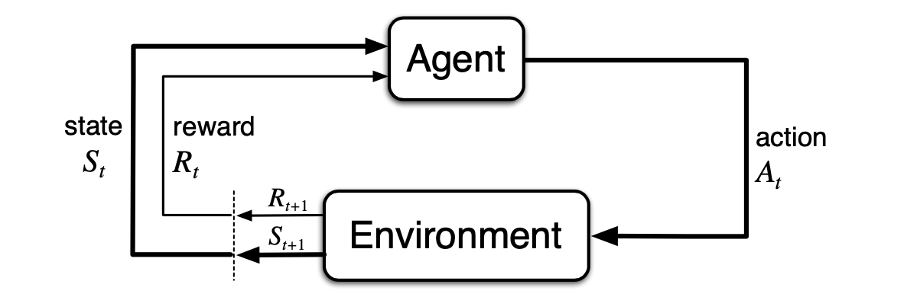

# The CartPole Environment and establishing control over the cartpole in it

Details on the environment: https://gymnasium.farama.org/environments/classic_control/cart_pole/

**Problem Description**: 
This environment corresponds to the version of the cartpole problem described in [Neuronlike adaptive elements that can solve difficult learning control problems, Andrew Barto, Richard Sutton, CW. Anderson, 1983](https://github.com/dimitarpg13/gymnasium-demo/blob/main/docs/Neuronlike_adaptive_elements_that_can_solve_difficult_learning_control_problems_Barto1983.pdf).
A pole is attached by an un-actuated joint to a cart, which moves along a frictionless track. The pole mechanically acts as a pendulum. The pendulum is placed upright on the cart and the goal is to balance it by applying forces in the left and right direction on the cart. The cart is free to move within the bounds of one-dimensional track. The pole is free to move only in the vertical plane of the cart and track. The controller can apply an impulsive left or right force $F$ of fixed magnitude to the cart at discrete time intervals. The cart-pole model has 4 state variables:

$x$ - position of the cart on the track.\
$\theta$ - angle of the pole with the vertical.\
$\dot{x}$ - cart velocity.\
$\dot{\theta}$ - rate of change of the angle.

The parameters of the problem are the pole length and mass, cart mass, coefficients of friction between the cart and the track, and at the hinge between the pole and the track, the impulsive control force magnitude, the force due to gravity, and the simulation step size. 
We assume that the equations of motion of the cart-pole system are not known and there is no pre-existing controller which can be immitated. 
At each time step, the controller receives a vector giving the cart-pole system's state $s \in \mathcal{S}$ at that instant. 

## Random cartpole games

python code: [random_cartpole_games.py](https://github.com/dimitarpg13/gymnasium-demo/blob/main/gymnasium_demo/random_cartpole_games.py)

## Devising an algorithm to control the cartpole in the Cartpole environment

### The algorithm in the article by Barto and Sutton

The article delineates the presence of two _adaptive_ elements as essential piece of their algorithm: associative search element (_ASE_) and adaptive critic element (_ACE_). The presence of _ACE_ creates a reinforcement learning feedback loop which improves the performance of the algorithm. The _ASE_ must discover what responses lead to improvements in performance. The _ASE_ employs _trial-and-error_, or _generate-and-test_ search process. In the presence of input signals it generates actions by a random process. Based on feedback that evaluates the problem-solving consequences of the actions, the _ASE_ "tunes in" input signals to bias the action-generation process, conditionally on the input, so that it will more likely generate the actions leading to improved performance. The optimal action depends on the value of the input signal which is the state $s$. Actions that lead to performance improvement in the presence of specific input signals are stored in an _association map_ which is a special data structure. This stochastic search process is denoted as _associative search_ by Barto and Sutton.

The reinforcement learning process generates actions as responses to a random process that is biased by the combination of its weighted values and input patterns. To supply a signed error signal the environment must know what the actual action was and what it should have been (aka _target_).

### Using and Implementing Deep Q Network

We use $Q$ function to define a target for the current state $s$.

$loss = \left( r + \gamma \max_{a' \in \mathcal{A}} Q'\left(s,a'\right) - Q\left(s,a\right)\right)^{2}$

