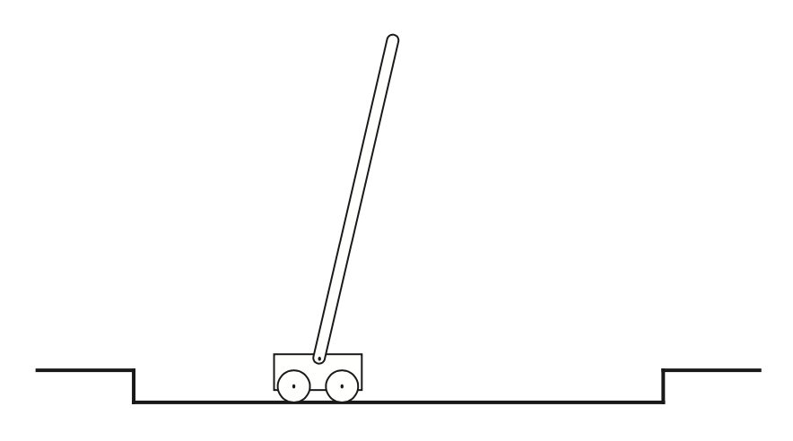

# The CartPole Environment and establishing control over the cartpole in it

Details on the environment: https://gymnasium.farama.org/environments/classic_control/cart_pole/

**Problem Description**: 
This environment corresponds to the version of the cartpole problem described in [Neuronlike adaptive elements that can solve difficult learning control problems, Andrew Barto, Richard Sutton, CW. Anderson, 1983](https://github.com/dimitarpg13/gymnasium-demo/blob/main/docs/Neuronlike_adaptive_elements_that_can_solve_difficult_learning_control_problems_Barto1983.pdf).
A pole is attached by an un-actuated joint to a cart, which moves along a frictionless track. The pole mechanically acts as a pendulum. The pendulum is placed upright on the cart and the goal is to balance it by applying forces in the left and right direction on the cart. The cart is free to move within the bounds of one-dimensional track. The pole is free to move only in the vertical plane of the cart and track. The controller can apply an impulsive left or right force $F$ of fixed magnitude to the cart at discrete time intervals. The cart-pole model has 4 state variables:

$x$ - position of the cart on the track.\
$\theta$ - angle of the pole with the vertical.\
$\dot{x}$ - cart velocity.\
$\dot{\theta}$ - rate of change of the angle.

The parameters of the problem are the pole length and mass, cart mass, coefficients of friction between the cart and the track, and at the hinge between the pole and the track, the impulsive control force magnitude, the force due to gravity, and the simulation step size. 
We assume that the equations of motion of the cart-pole system are not known and there is no pre-existing controller which can be immitated. 
At each time step, the controller receives a vector giving the cart-pole system's state $s \in \mathcal{S}$ at that instant. 

\
Figure 1: Cart-pole example

## Random cartpole games

python code: [random_cartpole_games.py](https://github.com/dimitarpg13/gymnasium-demo/blob/main/gymnasium_demo/random_cartpole_games.py)

## Devising an algorithm to control the cartpole in the Cartpole environment

### The algorithms in the article by Barto and Sutton

The article delineates the presence of two _adaptive_ elements as essential piece of their algorithm: associative search element (_ASE_) and adaptive critic element (_ACE_). The presence of _ACE_ creates a reinforcement learning feedback loop which improves the performance of the algorithm. The _ASE_ must discover what responses lead to improvements in performance. The _ASE_ employs _trial-and-error_, or _generate-and-test_ search process. In the presence of input signals it generates actions by a random process. Based on feedback that evaluates the problem-solving consequences of the actions, the _ASE_ "tunes in" input signals to bias the action-generation process, conditionally on the input, so that it will more likely generate the actions leading to improved performance. The optimal action depends on the value of the input signal which is the state $s$. Actions that lead to performance improvement in the presence of specific input signals are stored in an _association map_ which is a special data structure. This stochastic search process is denoted as _associative search_ by Barto and Sutton.

The reinforcement learning process generates actions as responses to a random process that is biased by the combination of its weighted values and input patterns. To supply a signed error signal the environment must know what the actual action was and what it should have been (aka _target_).

\
Figure 2: Reinforcement learning loop

Barto and Sutton then discuss the partitioning of the original problem into a set of independent subproblems which they denote as the _"box system"_. They use identical _generate-and-test_ rule to solve each subproblem. They divide the four dimensional cart-pole state space into disjoint regions (aka _boxes_) by quantizing the four state variables. Barto and Sutton introduce up to six quantization thresholds for each state variable:

$x: \pm 0.8, \pm 2.4\ m$\
$\theta: 0, \pm 1, \pm 6, \pm 12\ \degree$\
$\dot{x}: \pm 0.5, \pm \infty\ m/s$\
$\dot{\theta}: \pm 50, \pm \infty\ \degree/s$.

This yields $3 \times 3 \times 6 \times 3 = 162$ regions corresponding to all of the combinations of the intervals. 

#### The original "Demon-in-a-Box" Algorithm for balancing the cartpole before Barto and Sutton
Each box is imagined to contain a _local demon_ whose job is to choose control action (_left_ or _right_) whenever the system state enters its box. The local demon must learn to choose the action that will tend to be correlated with long system lifeline, that is, a long time until the occurence of the failure signal. 

A _global demon_ inspects the incoming state vector at each time step and alerts the local demon whose box contains that system state. When a failure signal is received, the global demon distributes it to all local demons. Each local demon maintains estimates of the expected lifetimes of the system following a _left_ decision and following a _right_ decision. A local demon's estimate of the expected lifetime for _left_ is a weighted average of actual system lifetimes over past occasions that the system state entered the demon's box and the decision _left_ was made. The expected lifetime for the decision _right_ is determined in the same way for occasions in which a _right_ decision was made. More specifically, upon being signaled by the global demon that the system state has entered its box, a local demon does the following:

1) it chooses the control action _left_ or _right_ according to which has the longest lifetime estimate. The control system emits the control action as soon as the decision was made
2) it remembers which action was just taken and begins to count time steps
3) when a failure signal is received, it uses its current count to update the _left_ or _right_ lifetime estimate, depending on which action it chose when its box was entered.

Notice that since the effect of a demon's decision will depend on the decisions made by other demons whose boxes are visited during a trial (a trial is the time period from reset to failure), the environment of a local demon, consisting of the other demons as well as the cart-pole system, does not consistently evaluate the demon's actions.

#### Barto and Sutton's contributions to the "Demon-in-a-box" algorithm

1. The _ASE_ element

Barto and Sutton chose neuron-like implementation for the _ASE_ element in their algorithm.

The local demon corresponds to the mechanism of a single neuron synapse and the output pathway of the postsynaptic element (the _ASE_) provides the common pathway for control signals. To accomplish the global demon's job of activating Barto and Sutton introduced a decoder that has four real-valued input pathways (for the system state vector) and $162$ binary valued pathways corresponding to the boxes in the original "Demon-in-a-box" algorithm. Te decoder effectively selects the synapose corresponding to the appropriate box through the $162$-components binary vector output.
 
_ASE_'s input is determined from the current cart-pole state vector by decoder that produces output vector consisting of zeros with single one indicating which one of the 162 boxes contains the state vector. _ASE_'s output determines force applied to cart. Reinforcement is constant throughout trial and becomes $-1$ to signal failure.

The other job of the global demon is to distribute a failure signal to all of the local demons - this is implemented via the reinforcement pathway of the _ASE_ element which receives the failure signal and distributes the information to all of its relevant synapses.

In more detail, the _ASE_ is defined as follows. The element has a reinforcement input pathway, $n$ pathways for nonreinforcement input, and a single output pathway (see Figure 3 below). Let $x_{i}\left(t\right), 1 \leq i \leq n$, denote the real-valued signal on the $i$th non-reinforcement input pathway at time $t$, and let $y\left(t\right)$ denote the output at time $t$. Associated with each nonreinforcement input pathway $i$ is a real-valued weight with value at time $t$ denoted by $w_{i}\left(t\right)$.

The element's output $y\left(t\right)$ is determined from the input vector $X\left(t\right) = \left(x_{1}\left(t\right),...,x_{n}\left(t\right)\right)$ as follows:

$$y\left(t\right) = f\left[\sum_{i=1}^{n} w_{i}\left(t\right)x_{i}\left(t\right) + noise\left(t\right) \right] \ \(1)$$

\
Figure 3: The _ASE_ controller for the cart-pole system. 

### Using and Implementing Deep Q Network

We use $Q$ function to define a target for the current state $s$.

$loss = \left( r + \gamma \max_{a' \in \mathcal{A}} Q'\left(s,a'\right) - Q\left(s,a\right)\right)^{2}$

